```{r setup, include=FALSE}
knitr::opts_chunk$set(echo = FALSE)
```

# CRIPTOMONEDAS

¿Criptomonedas = Bitcoin?

## Datos utilizados

```{r echo=FALSE, out.width = "750px", out.height="500px",fig.align='center'}
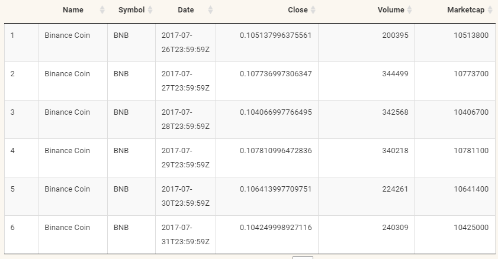
```


## Surgimiento de altcoins

```{r echo=FALSE, out.width = "750px", out.height="500px",fig.align='center'}
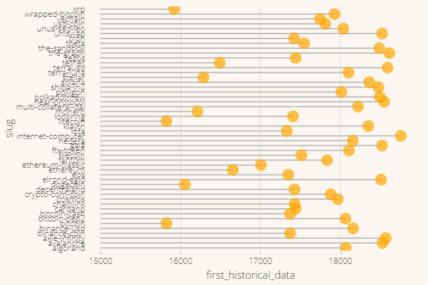
```

## Correlacion entre precio BTC y surgimiento altcoins

```{r echo=FALSE, out.width = "750px", out.height="500px",fig.align='center'}
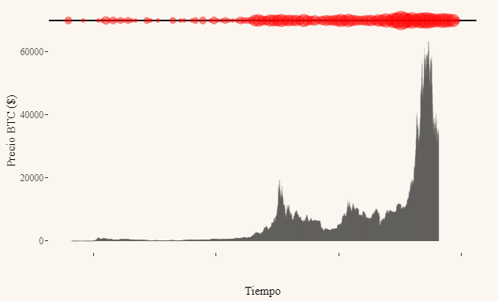
```

## Criptomonedas con mas volumen (2013)

```{r echo=FALSE, out.width = "750px", out.height="500px",fig.align='center'}
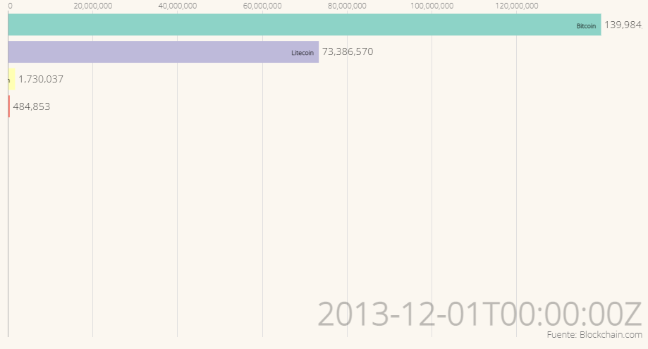
```

## Criptomonedas con mas volumen (2021)

```{r echo=FALSE, out.width = "750px", out.height="500px",fig.align='center'}
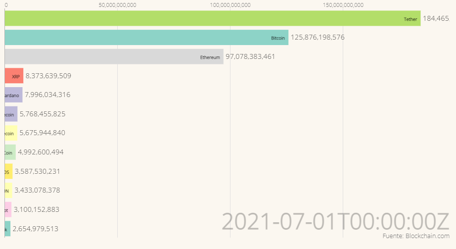
```

## % Marketcap por Crypto y Evolución precio Bitcoin

```{r echo=FALSE, out.width = "750px", out.height="400px",fig.align='center'}
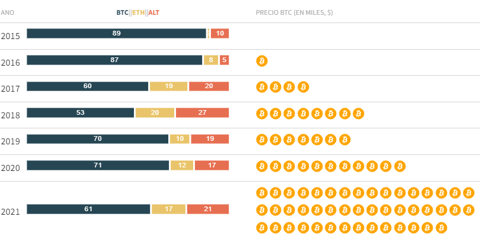
```

# Criptomonedas en el mundo

## % Poblacion poseedora de criptomonedas

```{r echo=FALSE, out.width = "750px", out.height="500px",fig.align='center'}
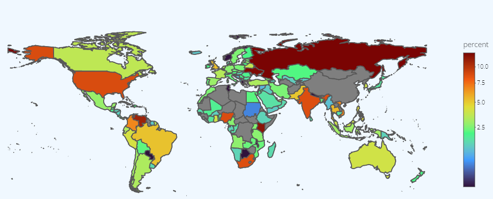
```

## Tabla con informacion de criptomonedas

```{r echo=FALSE, out.width = "750px", out.height="500px",fig.align='center'}
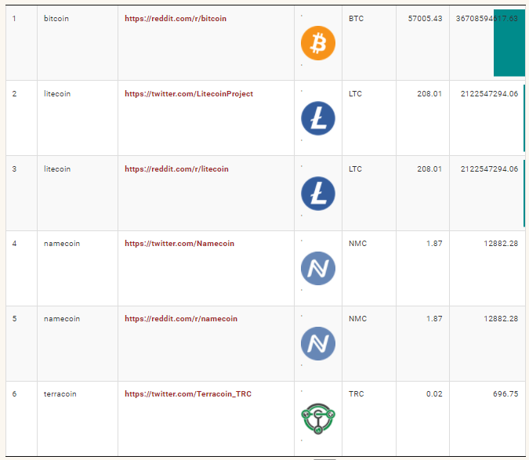
```

# BITCOIN
## Evolucion del precio

```{r echo=FALSE, out.width = "750px", out.height="500px",fig.align='center'}
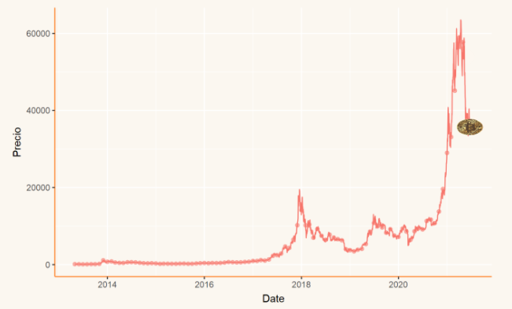
```

## Ciclo de Bitcoin
```{r echo=FALSE, out.width = "750px", out.height="500px",fig.align='center'}
knitr::include_graphics("Capturas/CICLOS.png")
```

## Analisis tecnico Bitcoin Medias moviles

```{r echo=FALSE, out.width = "750px", out.height="500px",fig.align='center'}
knitr::include_graphics("Capturas/media20.png")
```

## Analisis tecnico Bitcoin RSI(Relative Strengh Index)

```{r echo=FALSE, out.width = "750px", out.height="500px",fig.align='center'}
knitr::include_graphics("Capturas/rsiBTC.png")
```

## Analisis tecnico Bitcoin MACD

```{r echo=FALSE, out.width = "750px", out.height="500px",fig.align='center'}
knitr::include_graphics("Capturas/MACDBTC.png")
```

## Analisis tecnico Bitcoin Momentum

```{r echo=FALSE, out.width = "750px", out.height="500px",fig.align='center'}
knitr::include_graphics("Capturas/momentumbtc.png")
```

##  Precio respecto de la media y su tendencia
```{r echo=FALSE, out.width = "750px", out.height="500px",fig.align='center'}
knitr::include_graphics("Capturas/preciomedia.png")
```

## Comparación con Alt-Coins
```{r echo=FALSE, out.width = "750px", out.height="500px",fig.align='center'}
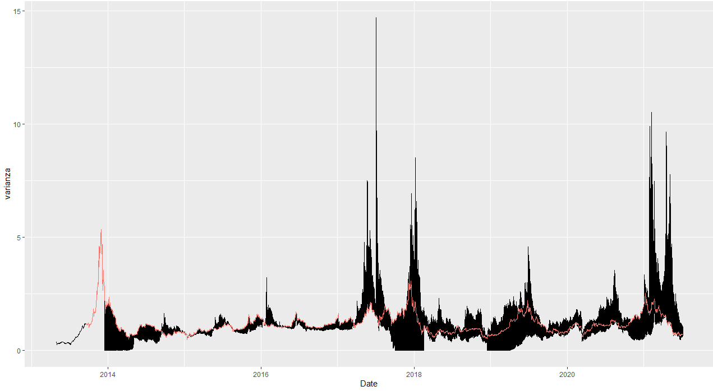
```

## Prediccion del precio de bitcoin

```{r echo=FALSE, out.width = "750px", out.height="500px",fig.align='center'}
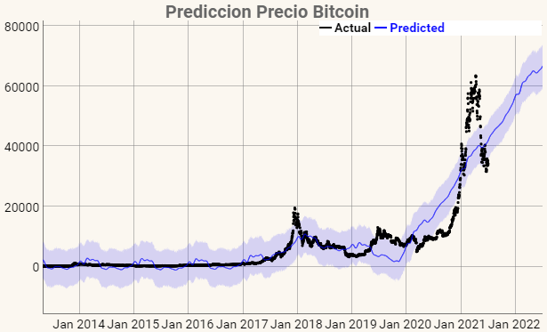
```

# Ethereum

## Evolucion precio ethereum

```{r echo=FALSE, out.width = "750px", out.height="500px",fig.align='center'}
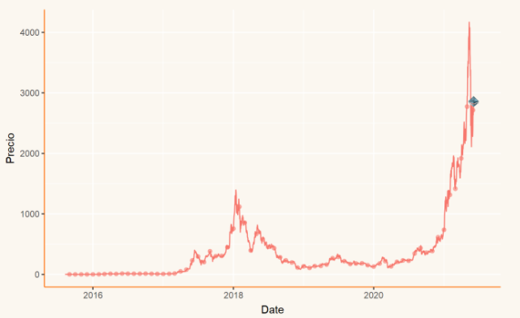
```

## Analisis Tecnico Medias moviles simples (50 y 200 dias)

```{r echo=FALSE, out.width = "750px", out.height="500px",fig.align='center'}
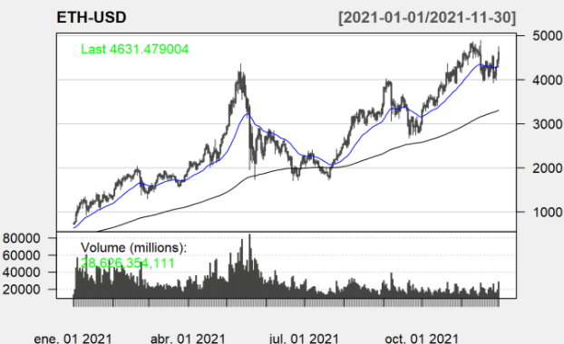
```

## Analisis Tecnico RSI (Relative Strengh Index)

```{r echo=FALSE, out.width = "750px", out.height="500px",fig.align='center'}
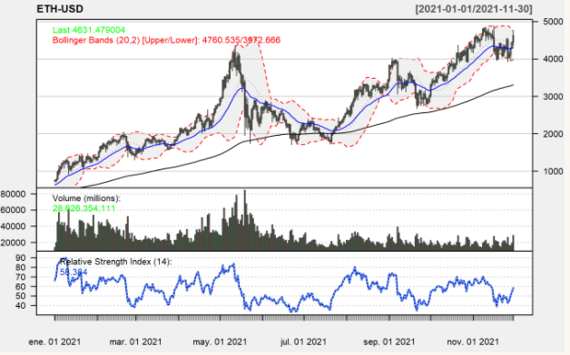
```

## Analisis Tecnico MACD

```{r echo=FALSE, out.width = "750px", out.height="500px",fig.align='center'}
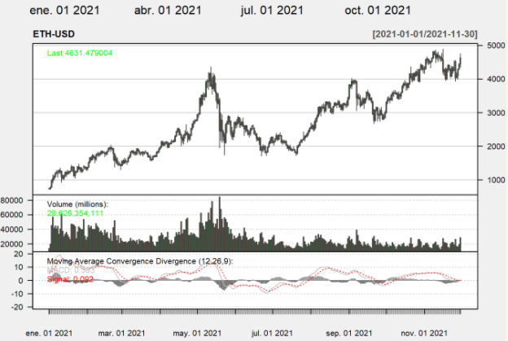
```

## Analisis Tecnico Momentum

```{r echo=FALSE, out.width = "750px", out.height="500px",fig.align='center'}
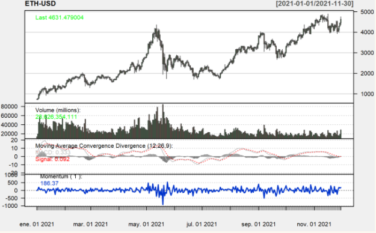
```

## Prediccion precio Ethereum

```{r echo=FALSE, out.width = "750px", out.height="500px",fig.align='center'}
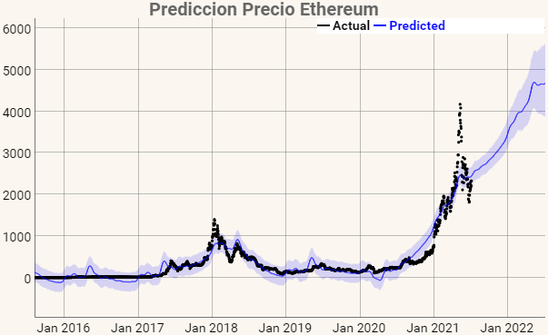
```


# Criptomonedas, ¿valor refugio?

## Retornos diarios Eth

```{r echo=FALSE, out.width = "700px", out.height="450px",fig.align='center'}
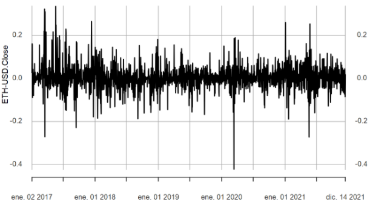
```

## Retornos diarios SP500

```{r echo=FALSE, out.width = "700px", out.height="450px",fig.align='center'}
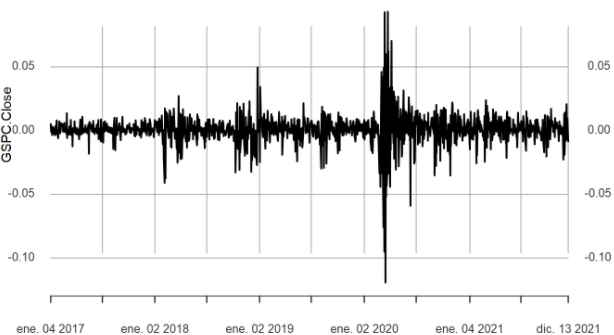
```

## Drawdown ETH

```{r echo=FALSE, out.width = "700px", out.height="500px",fig.align='center'}
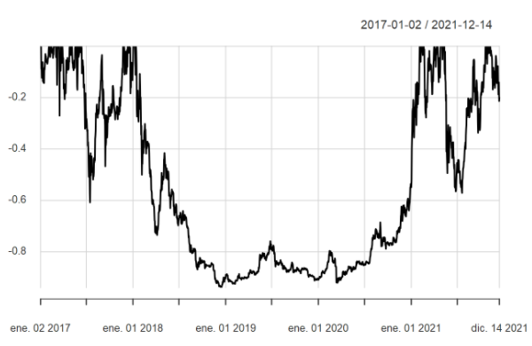
```

## Drawdown SP500

```{r echo=FALSE, out.width = "600px", out.height="450px",fig.align='center'}
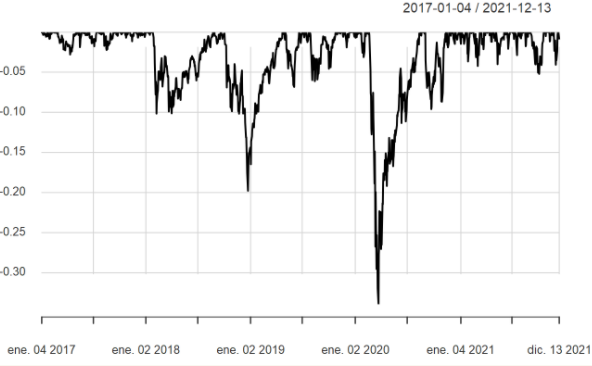
```

# Correlacion BTC y altcoins

## Betas entre BTC y altcoins

```{r echo=FALSE, out.width = "600px", out.height="450px",fig.align='center'}
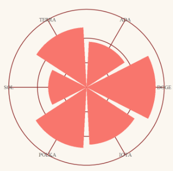
```

